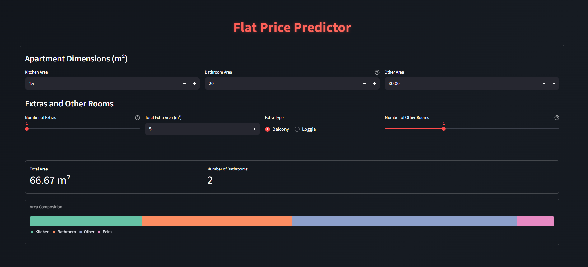
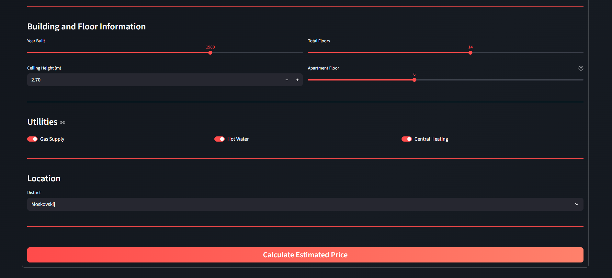

# Flat Price Predictor


---

## 🌌 Overview

**Flat Price Predictor** is a machine learning-powered web application designed to estimate real estate market values. By analyzing architectural details, location, and building specs, the system provides accurate price predictions in multiple currencies (RUB, GBP, LKR) through a modern, responsive interface.

---

## 📸 Screenshots




<p align="center">
  
</p>


---

## ✨ Key Features

- **Predictive Analytics**: Leverages a **CatBoost Regressor** for high-accuracy price estimations based on historical data.
- **Dynamic Web Interface**: Interactive sliders and inputs built with **Streamlit** for real-time user interaction.
- **Global Currency Conversion**: Integration with live exchange rate APIs to display values in ₽, £, and Rs.
- **Custom Aesthetic**: A tailored user experience using custom **CSS** for a sleek dark-mode design.

---

## 🛠️ Technology Stack

- **Backend Logic**: Python, NumPy, Pandas
- **Machine Learning**: CatBoost, Scikit-learn
- **Frontend**: Streamlit, Altair, CSS
- **Deployment**: Pickle (Model Serialization)

---

## ⚙️ Setup Instructions

This guide provides a step-by-step process for setting up the environment and running the prediction app.

### Prerequisites

- **[PyCharm](https://www.jetbrains.com/pycharm/)**
- **[Jupyter Notebook](https://jupyter.org/)**
- **Python 3.8+**

---

### 1. Project Setup
1. **Download the [Latest Release](https://github.com/TrevinsF/Flat-Price-Prediction/releases).**


2. **Extract the contents of the ZIP file to a preferred location on your computer.**


3. **Open Pycharm and navigate to the extracted project folder.**

### 2. Optional: Retrain or Customize the Model.
1. **Open the Notebook.**
```
Jupyter Notebook/
   ├── FlatPrice.ipynb
   ├── data.csv
   └── test.csv
```

2. **Modify or experiment with the parameters.**

3. **Run all Cells.**

4. **A pickle file named `flat_price_model.pkl` will be saved in the directory.**

### 3. Streamlit Web App
1. **Run PyCharm and open `script.py`.**
```
PyCharm/
   ├── script.py
   ├── flat_price_model.pkl
   └── styles.css
```

2. **Open Terminal `Alt+F12`.**

- **Install dependencies:**

```bash
pip install streamlit pandas numpy altair requests catboost pickle5
```

- **Run Streamlit.**

```bash
streamlit run script.py
```

Streamlit will automatically open in your default browser at: `http://localhost:8501`

---


<div align="center">
  <p>© 2026 Flat Price Prediction. All rights reserved.</p>
</div>
